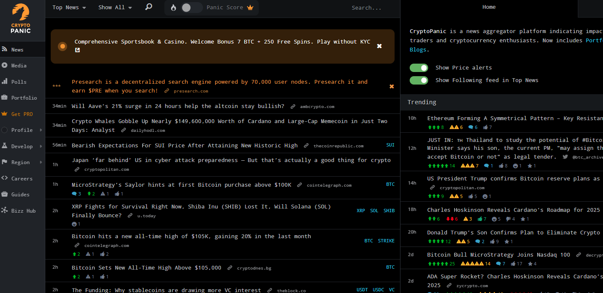
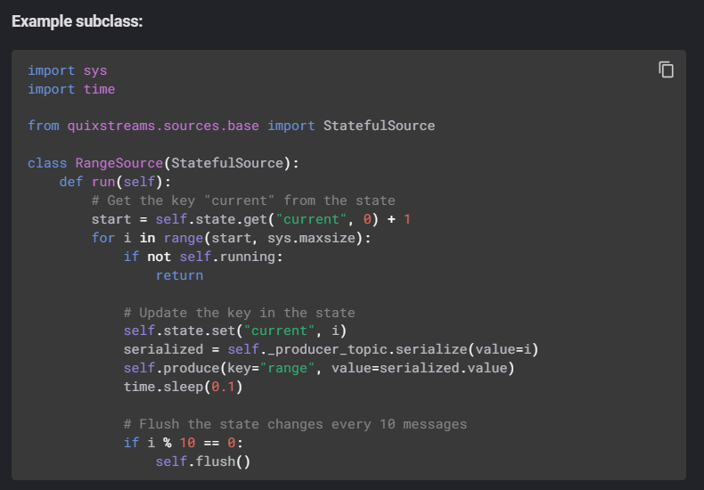
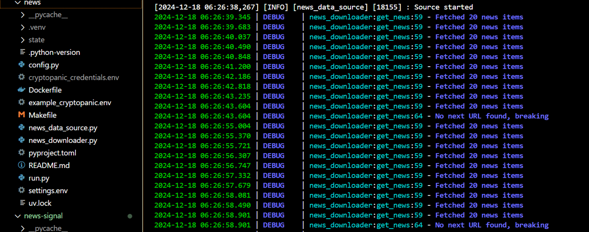

# Extract market sentiments with LLM

  

This pipeline leverages LLMs to extract market sentiments by processing news data from APIs, generating signals, publishing insights, and storing features in a feature store for further analysis and real-time feature views.  

## Business problem

The business problem involves analyzing vast, unstructured news data to extract actionable market sentiments, enabling timely decision-making, improving trading strategies, and gaining a competitive edge in dynamic financial markets.

## Use case

- Consumer and product news highlight reviews, announcements, and features of technology products.  
- Market research reports analyze industries, trends, competitive dynamics, and opportunities concisely.  
- Finance news covers investments, market movements, and significant economic updates.  
- Business relations news details partnerships, mergers, and acquisitions that shape competitive dynamics.  
- Legal news summarizes laws, policies, lawsuits, and intellectual property issues affecting technology.  

## System design

- Data Ingestion: Connect to CryptoPanic API for real-time news extraction.
- Microservices:
        - 3 microservices containerized with Docker for modularity and scalability.
- Data Transfer: Utilize Quix Streams for efficient streaming between services.
- LLM Deployment: Deploy Llama 3.2.3 and OpenAI GPT-4o-mini locally for market sentiment analysis.
- Feature Storage: Publish processed sentiment data to Hopsworks Feature Store, enabling feature views.

## Cost-Effective Backup with Dual LLMs

We use two LLMs, Got-4o-Mini and LLaMA 3.2, locally and on the cloud to ensure cost-effective backups.

## Ready to Use

LLM processes news data to generate sentiment signals, enabling a robust Training Service. Predictions can retrieve features from the Feature Store for real-time insights. Now, data scientists can use this system to train models efficiently and make data-driven decisions.  

## Process

### API

Get the API key from [CryptoPanic](https://cryptopanic.com/)  
  
&nbsp;
&nbsp;

### Data Streaming tools

Set up Quix Streams and implement the logic.
[QuixstreamsConnectors](https://quix.io/docs/quix-streams/connectors/sources/custom-sources.html#custom-sources-and-jupyter-notebook)

&nbsp;
&nbsp;

### Fetch data by batch

  
&nbsp;
&nbsp;

